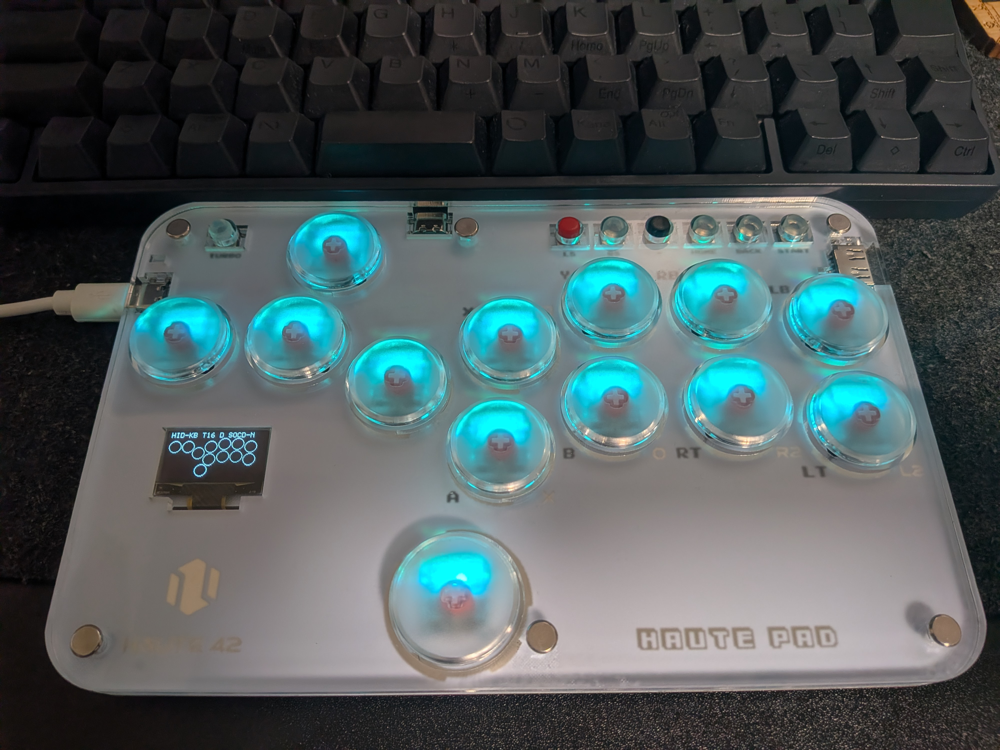

今日は22:30頃からダラダラ書いてます（Nintendo Directを見たいので…………）

## 今日やったこと

- 就活
- 東方原作
- Uber Eats配達

## インターン申し込みまくり

X(Twitter)で見かける”就活ガチ勢”には到底及びませんが、様々な企業のサマーインターンに申し込んでいます。 **純粋な技術力・パソカタ力で勝負になった時、大学生活を通して私の何倍もパソカタをやってきた人材に太刀打ちできるのだろうか？** という不安があるため、エンジニアにこだわらずIT系の幅広い業種・業界にエントリーしまくっています。

本当にこの記述で採用担当者は自分を採ってくれるのだろうか？そもそも自分の就活戦略はこれで合っているのだろうか？と不安になることもありますが、大学のレポートに関して **「出さない神レポより出すゴミレポ」** といった名言（迷言）があるように、エントリーシートも（人事の皆さんに迷惑をかけないのは大前提として） **「出さない神ESより出す雑魚ES」** という精神で勇気を出して提出しています。勇気とか言ってないで、まともに大学のキャリアセンターなどに顔を出すべきではあるのでしょうが……

ただ、自分からエントリーしておいて身勝手な話ではあるのですが、想像以上にB3夏の予定がインターンに圧迫されることに驚いています。たとえ第1志望群の企業のインターンに全て通ったとしても、いや全て通ってしまったら、今年の夏は大部分を **「選考ルートに乗っかるための無賃労働」** に費やすことになります。知識情報・図書館学類はその辺りを考慮してくれているのか、春C以降の時間割をかなりスカスカにしても問題ないのでまだ耐えではあるのですが……

## 東方やりまくり

後述する新コントローラーの操作に慣れるためにも、1日1回は東方原作を遊んで弾幕を身体で覚えようとしています。今日は永夜抄Normalを中心に詰めました。

### レバーレス買った

今まではLogicool F310rというゲームパッドを使っていたのですが、味変してみようと思い立って最近 **Haute42 S13** というレバーレスコントローラーを購入しました。

奥に写っているキーボードと比較してみると分かる通り、レバーレスコントローラーとしてはかなり小ぶりです。

Normalシューターなのになんでいきなりガチっぽいレバーレスを？と言われると、それは「私が形から入るオタクだから」としか言いようがないのですが、一応ちゃんとした理由もあります。STGだけでなく非想天則や憑依華などの黄昏格ゲー作品もそろそろ気合を入れて取り組みたくなってきたからです。

私が所属している[ツクテリア](https://www.stb.tsukuba.ac.jp/~tsukuteria/)は、今年度めでたく沢山の新入生に恵まれたこともあり、格ゲーを中心に遊んでいるメンバーも増えつつあります。格ゲーは今までほぼ遊んでこなかった人間なので、とりあえず操作系を統一させるためにもレバーレスに手を出してみた次第です。

## Uber配達しまくり

予定がない日はUber Eats配達員として弁当運びに務めています。今日も放課後から配達しました。

つくばは都心と比べて曜日ごとの需要の差が激しいのですが、火曜でもピークタイムであれば暇しない程度には注文が来ます。

---

そうこうしてるうちに24時が近づいてきました。まだ満足行くだけの文章量を担保できているとは思えず、どうしても尻切れトンボのような構成になってしまいましたが今後の成長に期待ということで……