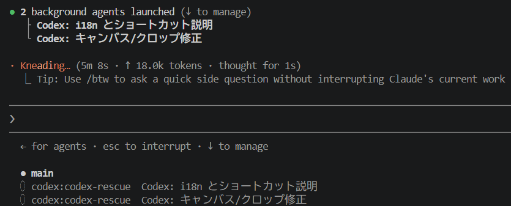

## 今日やったこと

- 春学期授業納め
- マルチエージェントの試用
- 久しぶりの炊飯

## 長めの夏休み開始

春Bの最後の授業が終わりました。明日も一応春B予備日という形にはなっていますが、自分が履修している科目の中で振替日が設定されたものはありません。春Cは1コマも履修登録していないので、 **今日をもって完全に春学期が終わった** ことになります。レポート課題がいくつか残ってはいますが、それらを片付けてしまえばあとは夏休みです。

3年生の夏は忙しいという話はよく聞きますが、今のところ大した予定は入っていません。とはいえ **「忙しくない」のではなく「忙しさが確定していない」だけ** で、ここまで呑気にしていられるのも今のうちです。今後インターンの日程が確定していけば、8月以降は様々な企業にお邪魔することになります。逆に、一切インターンに受からなかったとしたらそれはそれで大問題なので、夏休みのうちに面接・GDの対策をしたり各企業の説明会に行きまくったりと、就活の方針を軌道修正しなければいけません。

1, 2年生の間は夏を本当に無為に自宅クネクネして過ごしていたので、どう転んだとしても有意義なものにしたいです。そのための試みとして、就活に加えて毎日

- イラストを練習する
- パソカタでもアニメでもなんでもいいからインプットする
- 日記を続ける

の3本立てに励みたいと思います。

### 目指せ絵師

まずイラスト練習について。私はネット物心（平均的なインターネットリテラシーを身につけ、ネット上で正しく自己を確立している状態のこと）がついたときから **「創作者」という存在に対して憧れ** を抱いています。当時から何かしらに継続して取り組んでいたら人並みには創作能力が身についていただろうに、無駄に羨望するばかりで一切行動を起こしていませんでした。

個人的に、 **絵・文章・音楽はネット上の文化交流における「一次産業」のようなもの** だと思っています。綺麗なイラスト、軽妙な文章、記憶に残る音楽のどれか一つでも自信持って作れるようになれば、辛く厳しいインターネットの世界でも胸を張って堂々と生きていけるという ~~あまりにも過度な~~ 期待を抱いています。最も視覚的に成長度合いが分かりやすく、誰が見ても出来栄えを多少なりとも評価できるものは絵だと思うので、重い腰を上げてこの夏で取り組んでみようというわけです。

昨今ネット上にはイラストを描くためのノウハウがありふれていますが、では実際のところ愚直に努力したらド素人でも数ヶ月でなんとかなるのでしょうか？私が人柱になって検証しようと思います。来週頃には何かしら成長過程を晒すので、どうか生暖かい目で見守っていてください。

### インプットしたい

次にインプットについて。私はオタクみたいな面をしているのに東方以外のコンテンツを全く追っておらず、パソカタ面に関してもそこまで熱心にホットトピックを追えているとはいえません。というか東方すら完璧とはいえず、公式書籍は買ったものの積読している状態です。

YouTube Shortsを無限スクロールする指を止めて、なんでもいいので **コンテンツとして成立しているコンテンツ** を1日1時間はインプットしていきます。

### 日記も続けるよ

この日報に関しても続けていきます。毎日30分以上カタカタ文章を練る体験はなかなか頭を使いますし、1日で起きた出来事を振り返る貴重な機会になっています。内容が **「きょうはなんにもないすばらしい一日だった」** だけで終わる日々が訪れないよう、色々と新しい経験を積めたら良いなと思います。

以上が私の夏の決心となります。日報的な内容からは若干外れますが、三日坊主にならないようここで宣言しました。



↑サムネ面白い

## AI指示出し職人

さて、絵を練習する中でクロッキー用のツールが欲しくなり、適当にvibe-codeしようと思いつきました。普段やっているように単独のコーディングエージェントに一任すれば済む規模ではあるのですが、どうせなら最近流行っているらしい **マルチエージェント** を使ってみることにしました。

Claude Opus 4.8にCodexを使役させるのがオススメという話も聞いたことがありますし、 **ChatGPT PlusとClaude Proに合計6000円/月以上納めている** 状況を有効活用するに越したことはないでしょう。

早速、



このOpenAI公式プラグインをClaude Codeに入れてみて、「Codexを並列稼働させてなんとかやってみてくれ」と指示を飛ばしてみました。

するとスクリーンショットのように複数サブエージェントが起動し、Claude Opus 4.8が上司、GPT-5.5が部下として働き始めました。 **GPT側がgit操作を遂行できず、Claudeが巻き取ろうとした結果mainにコミットしてしまう** というお茶目な場面もありましたが、概ね想定通りに素早く実装してくれたので満足です。

ただ

- 複数のプロセスを同時稼働させる都合上、当然レートリミットに当たりやすくなること
- モジュール化が上手く行えていないリポジトリでは、コンフリクト防止のため並列稼働が難しくなること

の2点は当然対応しておく必要がありました。どこか人間のチーム開発に似たところがあって面白いので、今後もレートリミットに余裕がある時は試してみようと思います。

## 米を炊く

コシヒカリを買って炊きました。今までは米を炊く手間よりも外食するコストの方を受け入れていたのですが、冷静に考えると **ちゃんと米を炊いたら外食より圧倒的に食費が浮く** という事実に気付きました。当然すぎる。

5kg3000円の白米は伊達じゃなく美味しかったので、明日以降も沢山食べて元気も～りもりになりたいです。

---

今日はこの辺で終わり！