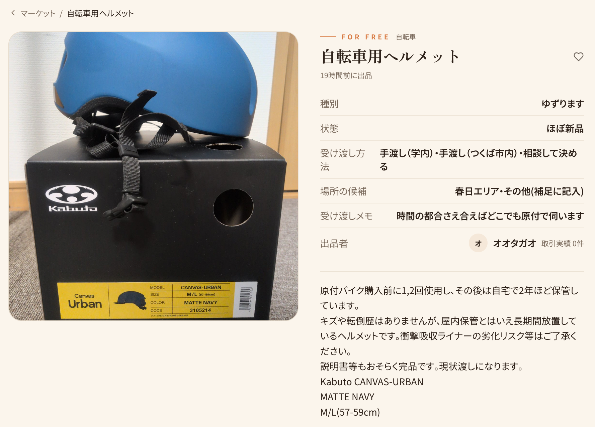

寝落ちしてしまったので7/1に書いてます

## 今日やったこと

- Uber Eats配達
- **モンスターの新味購入**
- サークル
- **UniDropの物々交換に出品**

## モンエナ飲むよ♪新味飲むよ♪

モンスターエナジーの新フレーバー、バッドアップルの発売日だったので、買って飲みました。東方のオタクなので。

<blockquote class="twitter-tweet">
夢見てる♪何も見てない♪ <a href="https://t.co/CXRinHYaUq">pic.twitter.com/CXRinHYaUq</a>
&mdash; オオタガオ (@otagao_otg) <a href="https://x.com/otagao_otg/status/2071877612558045380?ref_src=twsrc%5Etfw">June 30, 2026</a></blockquote>  

全体的にスッキリした味わいで美味しかったですが、 **個人的にエナドリに求めるフレーバーとは若干違う** なという印象です。今後も東方オタクの集まりがあればネタ枠で持っていくかもしれませんが、単純にエナドリが飲みたくなった時に通常フレーバーを差し置いて選ぶほどの評価はないかもしれない……

<iframe data-testid="embed-iframe" style="border-radius:12px" src="https://open.spotify.com/embed/track/6BOZISCnSSgm0N7sdPBckD?utm_source=generator&si=c21dbc62b22e470a" width="100%" height="152" frameBorder="0" allowfullscreen="" allow="autoplay; clipboard-write; encrypted-media; fullscreen; picture-in-picture" loading="lazy"></iframe>

<iframe data-testid="embed-iframe" style="border-radius:12px" src="https://open.spotify.com/embed/track/1et8yvUn1PcKH26pdYBxKl?utm_source=generator&si=d7e3697ced114900" width="100%" height="152" frameBorder="0" allowfullscreen="" allow="autoplay; clipboard-write; encrypted-media; fullscreen; picture-in-picture" loading="lazy"></iframe>

↑アレンジ聴くたびに思うんですが、原曲のサビにあたるパートがまるまるカットされた上でここまで人気になってるのヤバい

## 物々交換

**UniDrop** という **筑波大生限定のマッチングサービス** があります。性格診断への回答を元に一致度が高い相手をAIが推薦し、1週間限定のチャットセッションを展開するというサービスです。

私も一応登録しており、何度かマッチしたことはありますが、未だ「1週間適当に雑談して終わる」状態より先に進展したことはありません。妥当なルートとしては1週間のうちにInstagramなどの外部SNSのアカウントを教えて相互フォローになり、そこで会話を続けるべきなのでしょうが、なかなか難しいすね。

そんなUniDropにアップデートが来て、 **「ぶつぶつ交換」機能** が実装されました。マチアプで物々交換というのは意味不明な気もしますが、運営側の方針としては恋人だけでなく雑談相手や友人など、筑波大生同士のあらゆるつながりを支援したいのだと思われます。

ちょうど家で放置していた自転車用ヘルメットがあったので、試しに「対価を求めず譲る」モードで出品してみました。今はほぼ原付にしか乗らないので、自転車で毎日移動している学生の手に渡ればいいなと思います。

この記事読んでる筑波大生で欲しい人がいたら是非。

ちなみに「譲ってくれる人を募集する」モードもあるのですが、そちらの募集一覧画面を覗いてみるとかなり民度が終わっていて乾いた笑いが出ました。流石に通報システムぐらいは用意したほうがいいと思います。

---

6/30の内容としてはこれぐらいで。