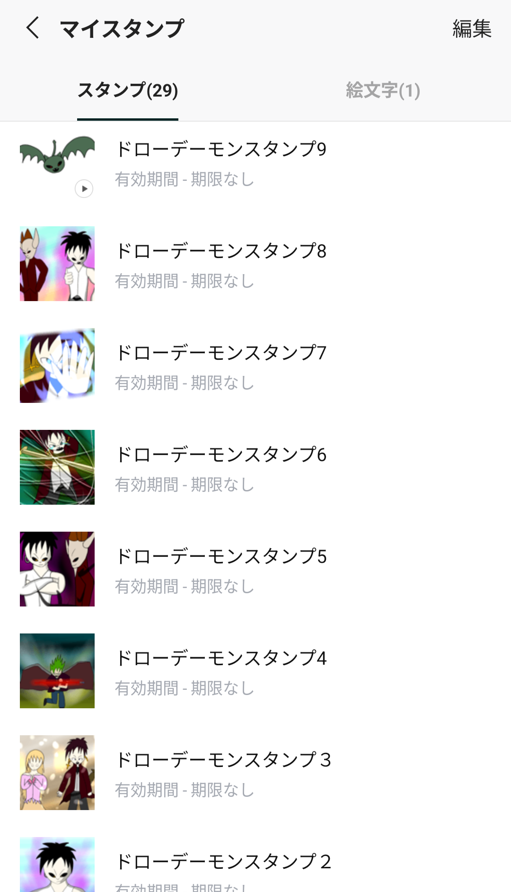

## 今日やったこと

- **カイザーデモンズを購入、トゥルーエンドまでクリア**
- 絶起
- Uber Eats配達

## ドローデーモンとは

今日の日報の本題に入る前に、まず **ドローデーモン先生** について紹介する必要があります。

ドローデーモン先生はイラストからシナリオライティング、楽曲制作、ボイス収録まで幅広く手掛けているマルチクリエイターです。 **「並々ならぬ努力を重ね、２０１３年にゲーム会社に就職」** しているとのことで、同人的な創作だけでなくしっかりとしたキャリアも拝察することができます。

http://drawdaemons.web.fc2.com/index.html

上記ページ「デモンズ・聖・ページズ」にアクセスしてみると分かる通り、本当に並々ならない努力による並々ならない作品の数々に本当にウズっと来ます。

**私が個人的に ~~最も擦っている~~ 最も尊敬しているクリエイター** で、販売されているLINEスタンプは全て購入しています。

使い所が無いようで微妙にあります。家族のグループLINEで使ったらめちゃくちゃ顰蹙を買いました。

氏の作品の魅力として、

- **「強ぇ奴と弱ぇ奴！東と西で分かれやがれ！」** といったウズっと来る台詞回し
- 技やモンスター名に関して、 **「自分より弱き者の命を奪いしたった一人の小さな巨悪魔」** など、修辞技法を感じさせるネーミングセンス
- 作品ほぼすべてを通して、 **「並々ならない努力」に基づく成長** を礼賛するポジティブな物語構造

などが挙げられます。

このように私はドローデーモン先生のことをかなり推しているのですが、実は氏の作品は無料で閲覧できるブログ媒体でしか読んだことがありませんでした。流石にこのままだと示しがつかないと思い、購入して遊んでみた次第です。

## 早速プレイ

カイザーデモンズはドローデーモン先生のサークル「ブラックピクチャー」が最初に制作したゲームです。東方Projectで例えるなら東方靈異伝、あるいは東方紅魔郷になります。

販売は **DLSite** で行われています。日付が変わった直後の深夜テンションで購入し、 **私の並々ならないDLSite作品購入履歴** にカイザーデモンズが並びました。

あらすじとしては、

> 主人公である **カイザー** がある日目覚めたところ、スライムに襲われて友人の **シルバー** を亡くしてしまう。街を守っているはずの **アナザーデーモン** は何をしているのかと家を尋ねると……

といった展開で始まり、その後カイザーが努力に努力を重ねて成長していくストーリーです。

ゲームエンジンにはRPGツクールが使われているのですが、単なるRPGの域にとどまらず、ホラー演出や俯瞰視点状態でのシューティングアクション要素など様々な魅力が詰まっていました。

基本的にストーリーは一直線に進むため、マルチエンドRPGやオープンワールドRPGに溢れた現代では少し見劣りするようにも思えますが、

- スタンプで使っていた語録の元ネタを摂取できる
- キャラボイスとしてドローデーモン先生の肉声を聴ける
- ~~大味すぎる~~ ダイナミックなレベリングシステムで爽快感がある

など並々ならない楽しさがありました。 **LINEスタンプに収録されている意味不明なシチュエーションのイラストに関して、その殆どにちゃんとした元ネタが存在する** と確認できて本当に衝撃を受けました。

## 努力に努力を重ねた後

数時間遊んでノーマルエンド直前まで到達したのですが、明らかにラスボスが硬すぎるという問題に直面しました。多少レベルを上げたところではどう考えても太刀打ちできそうにない強さです。ダンジョンに篭ってちゃんとレベリングしないといけないのか……と思いつつ実況動画（マジで複数の実況動画がネット上に存在する）を見てみると、なんと **クリア前からチート級に強い隠し技を入手できる** との情報を得ました。

正攻法としては

1. ノーマルエンドを迎える
2. 強くてニューゲーム、ステータス維持して2周目開始
3. 闇・ダーク（人名）を倒す
4. アナザーデーモンを倒す
5. アナザーデーモンから「迷宮ダンジョンに奥義書を隠した」との情報を入手する

といった流れになるのですが、 **普通にゲーム1周目の時点で奥義書がその座標に配置されている** 仕様になっています。太っ腹すぎる。

隠し技である **「スペシャルクロウ・スラッシュ」** （闇・ダークの必殺技）を入手したことで、ラスボスを瞬殺することが出来ました。

問題はトゥルーエンドです。先述したアナザーデーモンとの対決に勝利することでトゥルーエンドの条件を満たすのですが、彼はあり得ないぐらい硬すぎる上に1ターン目で **「強ぇ奴と弱ぇ奴！東と西で分かれやがれ！」** と宣いながら即死技を放ってきます。具体的な攻略方法は割愛しますが、単純な装備で解決する要素とレベリングでしか解決しない要素があり、なかなかの強敵でした。

最終的なプレイ時間はおよそ6時間ほど。太く短いゲームプレイとなりました。

そしてトゥルーエンドにたどり着いた後、泥のように眠って起きたら15時でした。Uber Eatsの昼ピークを逃したことに気付いたときには本当にウズっと来ましたね。

---

みなさんも是非買って、東に分かれることを目指してみてはいかがでしょうか。660円です。

https://www.dlsite.com/home/work/=/product_id/RJ139420.html