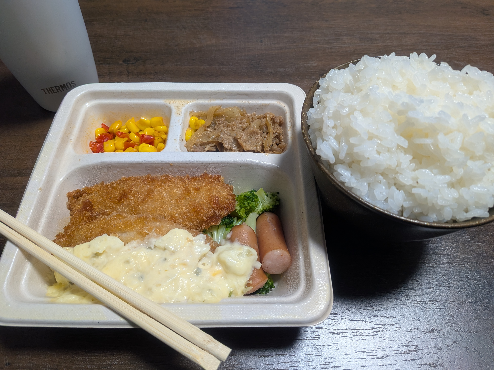

## 今日やったこと

- **AIに環境をぶっ壊されたことに気付く**
- **Uber Eats配達**
- **テーブル届く**

## Vibe Settingの末路

昨日ブログを書いている途中、一旦ローカルでhugo（このブログの基盤となっている静的サイトジェネレーター）のサーバーを立ち上げて確認しようとしたところ、ターミナルが「`The term 'hugo' is not recognized as a name of a cmdlet, function, script file, or executable program.`」などと抜かし始めました。

変な挙動だなとは思ったのですが、対処する前に記事を書き上げてしまおうと思って一旦無視し、そのままmarkdownの状態でガリガリ書いてコミット・プッシュしてしまいました。 **どうせ世界中からhugoが消え失せたわけではないだろう** と思っての行動であり、実際リモート側はちゃんとビルドが通って記事の更新も反映されました。

そんなhugo消失事件については寝たらほぼ忘れかけていたのですが（←のんき）、起き抜けにちょっとPython製のアプリをいじりたくなって`uv`コマンドを実行したところ「`The term 'uv' is not recognized as a name of a cmdlet, function, script file, or executable program.`」同様のエラーが出てしまいました。考えられる原因としては、

1. **各種ツールがWindowsの環境変数から外れている**
2. 「こいつのPCに入ってるツールをアンインストールさせて不便にさせてやるぜ」と企む、 **遠回しすぎる戦術を選んでいるハッカーにPCの制御権を奪われた**
3. **世界中からいきなりhugoやuvの概念が消失した**

この中で一番現実的なのは1でしょう。冷静に考えると、[先日](260703-daily#レポート)レポートを執筆するために **Codexに全てを任せてPC全体にLaTeXをインストールさせた** のが影響しているとしか思えなくなりました。

Codexのチャット履歴を辿って該当セッションに再度入り、「お前何やってん」と問い質したところ、案の定 **破壊的にPATHを編集していた** ことを自白し、ログを元に軽い操作で復元してくれました。もし履歴が残らないような形式で対話していた場合、本当に犯人がCodexなのかすら確証が持てない状態で色々と試さないといけない状況に置かれていたはずです。

**OSの根幹部分をコーディングエージェントに触らせた上で全ての操作をよく見ずに承認する** という行為の危なさ、愚かさを肌で感じることとなりました。

## 暑すぎる

今日のUber配達は17時過ぎの夜ピークから始めました。それでも明らかに暑く、梅雨が明けつつあるのを感じます。

去年の夏、私は半袖Tシャツにジェットヘルメットを被ってUber稼働していました。とてつもなく日焼けしたため途中から長袖インナーを着るようにはなりましたが、それでも **いつ死んでもおかしくないような軽装備** でした。

今年の夏は流石にリスクは取りたくないなと思っていたところ、たまたま5月に[SSTR](https://sstr.jp/)というツーリングイベントに参加することとなりました。流石に出先で事故って大怪我でもしたら一大事なので、一旦真剣に装備を揃えてみようと思い立ち、きちんとした防護効果のあるプロテクターメッシュジャケットとシステムヘルメット[^1]を購入しました。

その装備を引き継いで利用し、Uber稼働する際も常に両者を着用して稼働しているのですが、流石に今日の暑さはこたえました。ヘルメットのエアインテークを全開にしようが、メッシュ素材のジャケットだろうが、静止している状態だと当然風が入ってこないため **屋外で頭から足まで覆っている罰ゲーム状態** になって苦しいです。今後は水分補給方法について検討しないと熱中症のリスクも高まってきそうです。

いよいよ夏が始まってきたなと思います。個人的には洗濯物が少なくて済むので夏の方が好きです。

## テーブルのある暮らし

[昨日の記事](260708-daily)で書いたテーブルが届きました。友人や家族などを家に呼ぶたびに毎回「テーブルはあったほうがいい」と言われていたのですが、 **普通に金欠過ぎて買えていませんでした。** テーブルって無くても不便さを感じにくい家具なので……

一切机が存在しない家に住んでいたわけではなく、今まではPC用のデスクと、引っ越し直後に買っためちゃくちゃ小さいテーブル[^2]を使っていました。食事する時は前者のPCデスクに諸々を配膳して食べていたのですが、普通に汚い上に行儀も悪いし、ついパソコンで作業しようとしてしまってムダに時間が食われていました。

そんな中、今日ようやく家にちゃんとしたテーブルが登場したわけです。早速テーブルに配膳して食事をしてみたところ、 **眼の前に食品しかないという状況に集中** することができ、すぐに完食することができました。

このように文章に起こしてみるとあまりにもやってることが **ガキのしつけ** すぎます。小学生が発見するようなことに未だに気付き続けている21歳です。

そんな今日の夕食がこちら。左に写っているのは三ツ星ファームという会社の宅配冷凍弁当です。 **弁当を運ぶことで収入を得ている人間が、運ばれた弁当を解凍して生を繋いでいる** というのは少しシュールかもしれません。

---

今日はこんな感じで。括弧の中に説明をダラダラ書くのもオタクすぎると思い、今回は脚注機能を使ってみました。

[^1]: フルフェイスヘルメットだが、顎部分のレバーを引っ張ることで前半分が開いて楽に着脱できる
[^2]: カブのリアキャリアに積めるギリギリのサイズを選んでそのまま持ち帰った