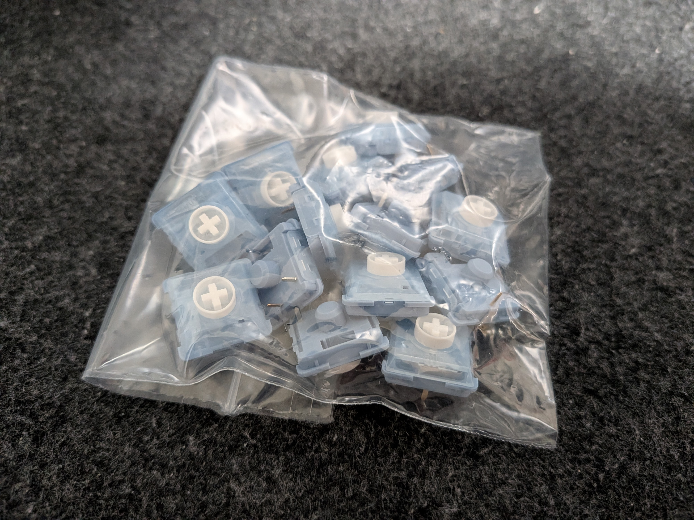

## 今日やったこと

- **オンライン面接**
- **東京散策**

## 初めての集団面接

夏インターンの面接を受けました。今まではグループディスカッションや個人面接しか経験がなかったのですが、今回初めて **集団面接** という形式を経験しました。

具体的な志望動機や志望コースの内容に直結する質問はほぼなく、「これまでの経験を踏まえてどのように物事に取り組むか」「行動するときどのようなことを心がけるか」といった **汎用的な経験・行動力について問う** 質問が中心でした。

夏インターンならではの設問なんでしょうか？各企業やプロジェクトに特化した想定で想定問答を組んでいたので、逆に基礎的な部分を問われているようで意識が改まりました。まだまだ就活初心者ですが、今一度立ち返って自分の芯から回答できるようになりたいなと思います。

## 東京散策

面接を受けた後はTXに飛び乗り、東京を散策しました。まずアキバの[遊舎工房](https://yushakobo.jp/)を訪れ、レバーレスコントローラー用のキースイッチを購入しました。

### レバレスカタカタ

今私は[Haute42 S13](260609-daily#レバーレス買った)というコントローラーを使っているのですが、デフォルトで装着されているキースイッチよりもストローク（キーを押し込んで反応する/底打ちするまでの距離）がかなり短くなって満足です。

ストロークが短くなったことにより、 **「薄型のキーボード」というより通常のコントローラーのスイッチと同じ感覚で入力できる** 状態になりました。しかも耐久性は（キーボード用のスイッチを使っているので当然）キーボードと同水準な上、故障したら瞬時に換装することもできます。

これでゲーム下手の言い訳がまた1つ無くなったため、より一層真面目に取り組んでいきたいなと思います。目指せ紅魔郷Lunaticノーコンクリア。

### 写真パシャパシャ

その後は十条と上野でそれぞれ用事を済ませました。どちらも少人数で完結する内容だったので、詳細については[この日記の縛り](260608-daily#決まりごと)上割愛します。

話は変わりますが、実家で親が使っていた **E-PL1s** というデジカメを譲り受けたので、最近色々と風景を撮っています。「カメラ趣味」と堂々と言うにはまだまだ下手くそですが、今日撮った写真を以下に3枚ほど現像したものを置いてみます。

