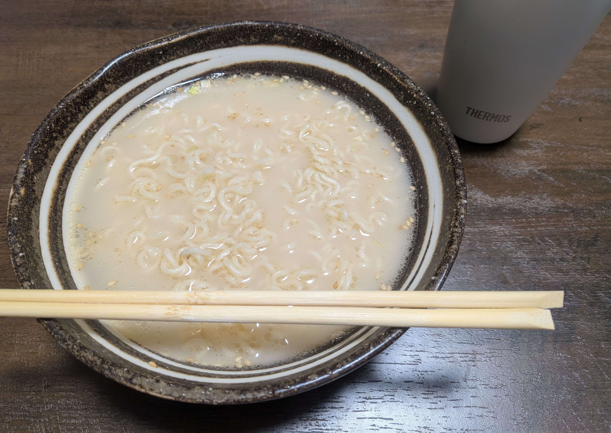

## 今日やったこと

- 特になし

## 何もない1日

本当に何もなく、何もしない1日でした。

Uber Eatsで稼働するにも微妙な天気ということもあり、自宅でゴロゴロしているといつの間にか1日が終わりました。

ここに書く内容が一切ないのはマズいと思い、おそらく **この家に引っ越してきて初めて鍋でインスタントラーメンを作る** ことにしました。

鍋で湯を沸かし、実家から仕送り代わりに送られてきた[うまかっちゃん](https://housefoods.jp/products/special/umakachan/)を投入。加熱を止めて粉末スープを入れると一気に懐かしい味が漂ってきました。

本当に自炊をしなさすぎて、 **そもそも今使っている鍋はIHに対応しているのか** すら分からない状態で突発的に始めたのですが、なんとかノントラブルで完成までこぎつけられて良かったです。