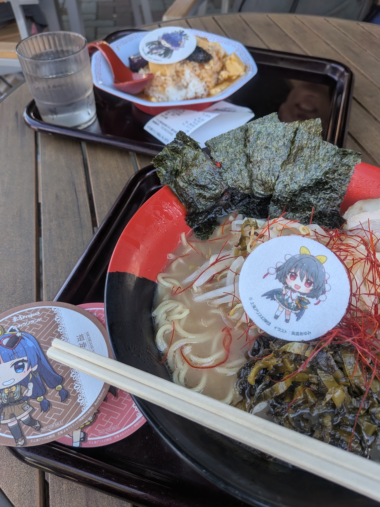

## 今日やったこと

- **よみうりランド遠征**

## 東方オタクで溢れる遊園地

サークルの面々でよみうりランドに行きました。 **私だけ交通費をケチってスーパーカブ110で向かった** ので往路/復路がなかなか大変でした。ただ、ピークから微妙に外した時間で向かえば下道でも3時間ぐらいで行ける上に、バイク駐輪場は園の眼の前で無料開放されているので選択肢として結構アリだと思います。

よみうりランドは東方Projectと3年連続でコラボをやっています。

コラボメニューやキャラパネルをはじめ、アトラクションでは東方キャラのラッピングがなされていたり、アナウンスにZUN氏やビートまりお氏など東方ゆかりの人物が採用されていたりと、なかなか気合が入っています。

フリーパスを買って全コラボアトラクションを巡り、園内では1日を通して全力で楽しむことができました。

## 解像しない

[先日と同じく](260717-daily/#写真パシャパシャ)E-PL1sを持っていったので色々と撮ってみたのですが、なんだか微妙にピントが合わないのが気がかりです。

まず理由として、Aモードで何も考えずF値を最低にセットして撮っているのが挙げられますし、15年前のカメラなのでAFの精度が甘いのはそりゃそうなんですが、それ以前に **シャッターを切った瞬間にフォーカスが外れる** ような挙動を示すのが気がかりです。UI上では画面中央に合わせてるのに、仕上がりを見てみると中央でさえ微妙にズレているという……

親からタダで貰ったカメラに文句言うなって話ですが、正直現状だと **Pixel 9aのカメラと比べて明確な利点を見いだせない** ことに若干の辛さがあります。Pixelならポケットにしまえるし、電源ボタン2度押しですぐ撮れて画質も申し分ないので、競争相手に持ち出すのは酷な話ではあります。

これも練習だと思って色々と試行錯誤中です。

↑園内唯一のわかさぎ姫要素

