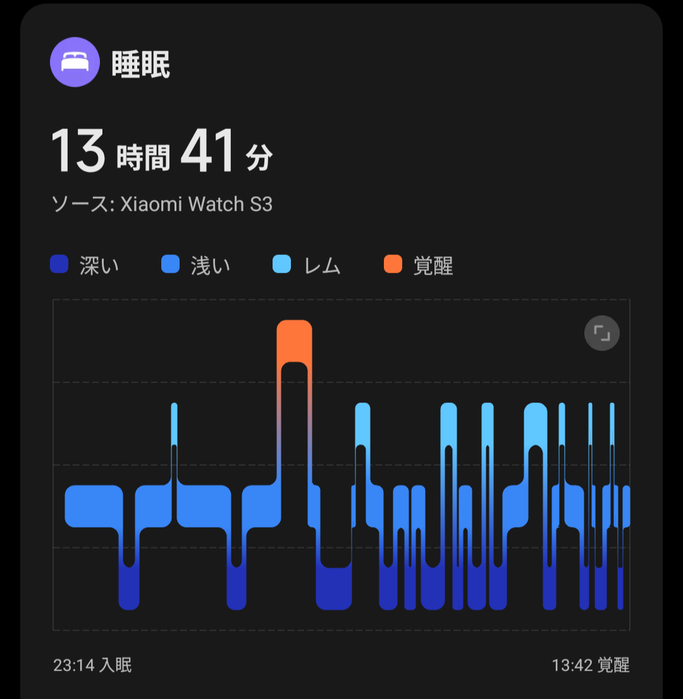

## 今日やったこと

- **14時前に起床**
- **サマーウォーズウォチパ**

## 爆睡人間

23時過ぎに寝落ちし、起きたら14時前でした。

どうも想像以上に疲れが溜まっていたようで、想定以上に長く寝てしまいました。Uberの稼働計画は若干狂いましたが、今まで溜まった疲れが一気に取れた（気がする）ので後悔はないです。

## サマーウォーズ

夜に自宅で突発的に **サマーウォーズ** のウォッチパーティーを行いました。個人的に毎年夏が始まるタイミングで必ず見るべき作品だと思っているので、最高気温が40°C近くなってきているこのタイミングは最適でした。

久しぶりに見て思ったのですが、ネットで繋がる仮想空間をフルダイブVRのような **専用の機器を用いて接続するSF的空間** ではなく、登場人物たちが自然に没入していく **あらゆるデバイスで接続可能なSNS的空間** として描写した先見の明は凄いなと思います。

「世界的に流行してるんだからあらゆるデバイスで接続できて当然」というリアリティと、「OZは現実でも成立しうるかもしれない」という想像力を視聴者に与えてくれる、とてもバランスの良い設定だと感じます。サマウォではめちゃくちゃ格闘ゲームが流行しているのに、端末ごとにどう考えても操作の自由度が違いすぎるだろ、というツッコミどころはありますが……

ますます暑くなっていきますが、パソコンも肉体もちゃんと冷やして熱暴走なく夏を乗り越えたいです。