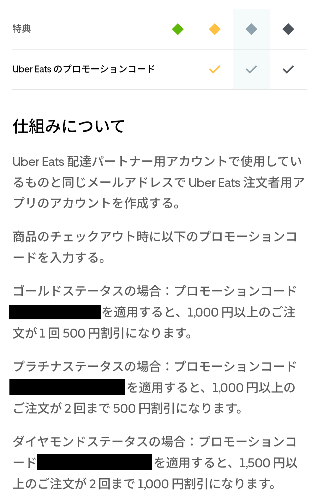
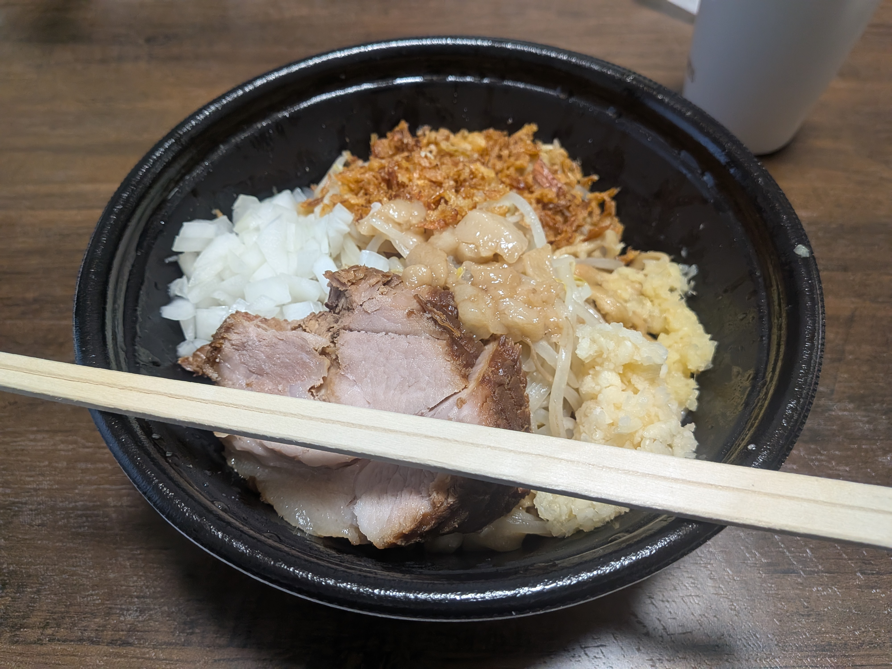

## 今日やったこと

- **Uberで汁無しラーメンを注文**
- **紅魔郷Lunaticに挑戦**

## 社割があるデリバリー

実はUber Eatsドライバーには社割があります。社割というより、配達件数によって上昇するステータスによって報酬が与えられます。

毎月1日から月末までに
- **30件** 配達するとゴールドステータス
- **100件** 配達するとプラチナステータス
- **300件** 配達するとダイヤモンドステータス

となります。1時間でおよそ3件は配達をこなせるので、真面目に稼働する月はプラチナステータスまでは容易に到達できます。

ランク報酬は細々としたものが色々と用意されていますが、最も嬉しいのがUber Eatsのプロモーションコードです。

プラチナステータスだと **月に2回まで1000円以上の注文が500円引き** されるコードが支給されます。諸々の手数料がおよそ500円前後なので、雑に考えると **月に2回までなら店頭とほぼ同じ値段で食べられる** ということになります。およそ30時間を捧げて合計1000円分のクーポンしか支給されないというのは福利厚生として微妙な気もしますが、貰えるものは貰っておきましょう。

ありがたくコードを使わせてもらい、久しぶりに注文者として『俺の生きる道』の汁無しラーメンを注文しました。

これはUber Eatsライフハックですが、 **二郎系をUberで頼むなら絶対に汁無し** にしましょう。私は普通のラーメンを頼んでスープの処理で地獄を見たことがあります。

頼んでみて思うのが、やはり **家でじっとしてるだけで食事が運ばれてくるのは便利すぎます。**

出前というシステムを一般化させたフードデリバリー各社の手腕には本当に感心します。企画会議で最初に「出前って便利だからもっと手軽に頼めるようになれば皆使いまくるんじゃないか？」と発言した人はかなりの切れ者だと思います。

大学を卒業するまでは今後もUber Eats配達員として働き続ける予定なので、これからも長い付き合いにしていきたいですね。（←何様？）

## 紅魔郷

紅魔郷をやりました。9月10日、 **東方紅魔郷New ClassicのリリースまでにLunaticを安定してクリアできるようになる** ことを目標に練習しています。

どれだけ東方原作が上手くても、初見でプレイする作品を一発でLunaticノーコンティニュークリアできる人はほぼいません。弾幕STGは高難易度になるほど、突発的な”気合避け”能力だけでなく、敵の出現位置や弾幕パターンをある程度把握しないと太刀打ちできない側面があるからです。

しかし紅魔郷New Classicに関しては話が違います。可能な限り従来の紅魔郷を再現すると公言されているからです。つまり、従来版紅魔郷のプレイスキルが十分にあればそのままNew Classicに転用でき、 **「一応、東方新作を初見Lunaticノーコンしましたけど……笑」と言えるようになる** 可能性が高まります。あまりにも詭弁すぎますし、不純な動機すぎますが……

とりあえずHard難易度ならぼちぼちクリアできるようになってきたので、もう少し練度を高めていきたいです。