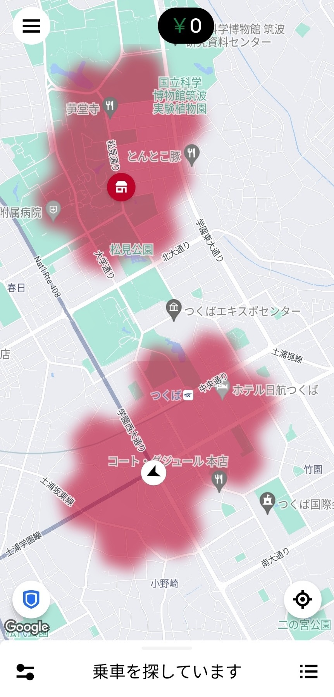

## Uber試験稼働

前々からUberで稼ごうと思っていたが、ついに重い腰を上げて自転車で試験的に稼働することにした。これがうまく行けば原付購入の資金調達手段として運用していく予定だ。

初期投資としては、Uberバッグに4000円、自転車用ヘルメットに5000円程度かかった。まあまあ痛い出費だが、ヘルメットに関しては以前から購入したいと思っていたし、Uberバッグについてはまぁ……小旅行するときに役に立つ……かもしれない。

Uberバッグを背負い、ヘルメットを被って、ついに私の初稼働がスタートした。億万長者への道が、今始まる——

依頼が来たらまず店に向かい、確認用の番号を伝えて商品を受け取り、届け先の家まで向かって商品を手渡しか置き配する。これが配達の流れだが、様々なイレギュラーが発生しうることも容易に想像できる。稼働を始める前に、YouTubeでUber配達員が発信する動画をいくつか見て、トラブル時の対処法についてもある程度知見を得た。

これは配達員のために用意された、Uber Driverアプリの画面だ。スプラトゥーン、あるいは陣取り系ioゲーム、あるいは最悪の血便みたいになっているのはAIにより「需要増」と判断されているエリアらしく、配達依頼が来る可能性が高まるらしい。ただ、先述した動画によると、あまりアテにならないそうだ。

研究学園駅やつくば駅の周辺を中心に、できるだけ赤色のエリアを通るように1時間ほど自転車を走らせ……

来た配達依頼は、**0件**。試験稼働、終了。

……いや、読者の皆さんの中には、なにそんな短時間で諦めてんねんもう少し続けろやと感じた人もいるだろう。しかし、今まで一度も配達依頼を受けたことのない人間が、脳内で配達の流れを何度も復唱し続けるのはなかなか精神に来るものがある。

例えるなら、いつボス戦が始まるか分からない通路を延々と歩き続けるようなものだ。一度配達を終えてしまえば、あとは経験値稼ぎの舞台としてそこそこの緊張度で挑み続けられるだろうが、初見の緊張度を保ったまま1時間移動し続けたことでかなりヘトヘトになってしまった。

加えて、ロゴが左右と後ろにあしらわれた広告みたいなバカでかいバッグを背負って自転車を漕ぐのはシンプルに恥ずかしい。

どうして1時間も依頼が来なかったのだろうか。理由はいくつか考えられる。

1. 自転車配達員はつくばエリアにおいて論外である可能性
	- 原付や軽貨物車での配達員に優先的に仕事が割り振られてしまい、いつまで経っても仕事が回ってこない？
2. Uberの利用者が減っている可能性
	- そもそも世間的にはコロナ禍が収まりつつある以上、割高なデリバリーサービスを利用するくらいなら実店舗に出向く人が増えるのは当然だといえる？
	- 報酬決定アルゴリズムの変化により、依頼厳選やボイコットのために依頼を断りまくっている配達員が増えているらしく、全体的な配送時間が伸びて評判が落ちている？
3. アカウントの信用度が低いため依頼の割り当てが後回しにされていた可能性
	- 一度も配達を行ったことのない配達員だから冷遇されていた？
	- Uber側が新規参入を防ごうとしている？

なんだかどんどん陰謀論チックな内容に逸れていってしまったが、具体的な原因は分からない。また明日にでも気を取り直してリトライしてみようと思う。

今日のところは敗けてしまったが、私のメイクマネー大作戦はまだ始まったばかりだ。笑いたきゃ、笑え——

## ブログ修正

今日の改善点をメモしておく。

- 目次が表示されるように
	- 今まで見出しは`h1`で指定していたが、どうも`h2`以降の方が良いらしい
	- `h2`以降に再指定するとまともに表示されるようになった
- カテゴリーとタグの使い分けを開始
	- 「日記」「備忘録」などはカテゴリー指定で運用していこうと思う
	- 読者側からするとほぼ同じように表示される
- [トップページ](/)のデザインを修正
	- 背景画像を表示するようにした
		- 画像は宿舎の自室から撮影した外の風景
- スクロールしてもヘッダーが追従するように調整した
- alert記法をまともに運用できるように
	- [昨日の記事](https://blog.otagao.net/posts/240802-battle-linear-algebra/#%E5%85%88%E5%B0%8E%E7%9A%84%E8%A2%AB%E9%A8%93%E8%80%85%E4%BD%93%E9%A8%93)では古典的（？）に「注：」と表記していたが、サンプルサイトを見て修正
- ダッシュ（——）が水平線（――）になっていたので修正
	- 仮にも図書館情報学徒の一員だというのに、今まで深く考えずに使ってしまっていた
	- 大学のレポートなどでそのまま使っていたら、その辺りに詳しい先生にとっては心象が悪化する一因となっていたかもしれない
	- 指摘してくれた[ソヴァ](https://x.com/sovantus_____)くんありがとう
- 記事ページ末尾にシェアボタンを設置

圧倒的成長で、夏が終わるまでには最強のブログが完成していることだろう。