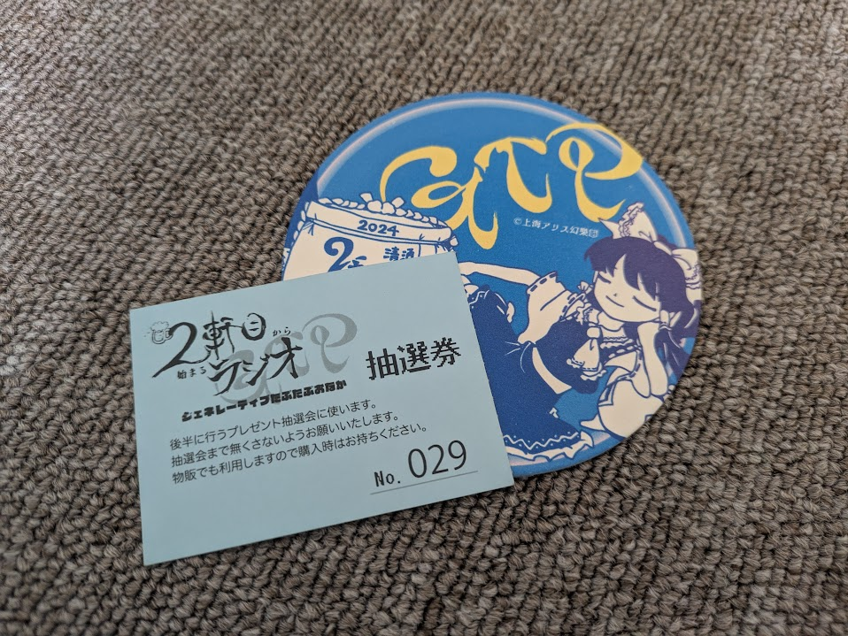

 



新作体験版のゲームプレイ、および過去作のおまけテキストに関わるネタバレが含まれます



## TL;DR

- 例大祭で体験版が頒布されて以降、主に海外のファンが「錦上京の背景にAIが使われてる！ZUNはダブスタだ！」と問題視していた
- Steamでの記述により、本当にAI画像が使用されていたことが明らかになった
- おそらくZUN氏はAdobe Fireflyで自発的に画像を生成しており、少なくとも権利面において金銭的な問題が発生することはないと考えられる
- 個人的にはZUN氏の選択・行為は少なくとも「ダブスタ」ではないと思う

## はじめに

この記事はあくまで、ネット上の主要な論点（と個人的な感情）を整理することを目的にしている。

建設的な議論における **「根拠」** 、あるいは叩き台とする上では存分に引用してもらいたいが、しょうもないレスバの **「証拠」「言質」** として引用するのは控えていただきたい。

## 何が起こっているのか

上海アリス幻樂団の新作『東方錦上京』の体験版が春例大祭にて頒布されて以降、 **「生成AI製の画像アセットが背景に用いられているのではないか？」** と一部で話題になっていた。

X上で検索すると日本語でもいくつか投稿がヒットするが、英語圏のほうが言及が多い。「[ZUN AI until:2025-05-10](https://x.com/search?q=ZUN%20AI%20until%3A2025-05-10&src=recent_search_click&f=live)」などのワードでパブサすると具体的な空気感が読み取れるだろう。堂々と内部データをぶっこ抜いて晒している人もいるので、まだ体験版を遊んでいない人は要注意。

度々Xで炎上騒ぎが起こる「AI絵師バレ」のような格好になっているのに加え、ZUN氏を批判する人の中には「過去のインタビューでAI使わないと言っていたじゃないか、方針転換するのが早すぎる」と主張する人も見受けられた。

そんな中、今日、満を持して公開された[Steamのページ](https://store.steampowered.com/app/3671710/__Fossilized_Wonders/)を確認すると、「AI生成コンテンツの開示」欄に

> 一部の背景テクスチャに、Al 生成コンテンツが含まれています。

と明確に、堂々と記述がなされていることが判明した。（何故かA"I"ではなくA"l"となっているが、これは流石に単なる入力ミス、あるいは機械変換の誤作動だと思う。これで「生成AIじゃなくて生成アルミニウムでした～ｗ」みたいな変なズラしだったらかなり失望する。）

AI製のコンテンツが用いられているのはあくまで「一部の背景テクスチャ」だけであり、キャラクターの立ち絵やBGMにおいては紛れもなくいつも通りのZUN絵、東方原曲である。これは私の主観に基づいてグダグダ説明するよりも、実際に体験版をプレイしてみるのが一番早い。

## 背景に画像生成AIを使うことに何の問題があるのか

私は **「権利上の問題は、少なくとも金銭的には発生しないだろう」「しかし、金銭によらない問題は発生しうるだろう」** と考える立場をとる。

何故なら、背景として採用されたAI画像は[Adobe Firefly](https://www.adobe.com/jp/products/firefly.html)を用いてZUN氏が自発的に生成したものである可能性が高いからだ。

私は昨年末に[２軒目ラジオGTP](https://t.livepocket.jp/e/nikenme_2024)に参加したのだが、そこでZUN氏は **「このイベントポスターの背景素材としてAdobe Fireflyを使用した」「これは何か著作権的な問題が発生したときにAdobeが責任を取ってくれる」** といった類の発言をしていた。

Adobe Fireflyとは文字通りAdobeが開発した生成AIであり、[公式ページ](https://www.adobe.com/jp/ai/overview/ethics.html)では「著作権や知的財産権を侵害するコンテンツを生成することがないよう開発され、安心して商用利用できるよう設計されています。」と主張している。

Fireflyの学習元は自社が運営する画像素材サイト「Adobe Stock」の画像、パブリックドメインの作品、そしてオープンライセンスの作品なので、権利的に問題がある画像が生成される可能性は低い。加えて[Adobe公式のプレスリリース](https://www.adobe.com/jp/news-room/news/202306/20230608_firely-and-express-to-enterprises.html)や[Adobe Stockの利用条件](https://stock.adobe.com/jp/enterprise-conditions)を読むと、有償プランのユーザーがFireflyで生成した画像に対して第三者が知的財産権侵害を申し立てた場合、（ユーザーが悪意ある使い方をしない限り）Adobeが補償するといった旨の記載がみられる。

つまり、仮に最悪の事態として

1. たまたま **錦上京の背景にめちゃくちゃ似た画像が存在** し
2. たまたま **その画像がAdobe Stockに無断アップロード** されており
3. たまたま **その画像がFireflyに学習されていた** ことが判明し
4. その画像の **権利者とZUN氏の間での交渉が決裂して裁判沙汰に** なった

としても、ZUN氏の懐が痛むことはないというわけだ。

ここまでケツ持ちしてくれる好都合なAIサービスが存在し、かつZUN氏が明確にその存在を知っており、さらに少なくとも一度は使ったことがあるのが確定している以上は、今回もZUN氏はFirefly経由で出力された画像を採用しているとみるのが妥当だろう。

しかし、Adobeは（特に英語圏のインターネット上で）クリエイターから近年非常に評判が悪く、 **「AIに魂を売り渡したevilな企業」** などと評されることもある。

- 「利用規約等をAI学習に有利なものに改変している」
- 「Adobe Stockの管理が不十分であり、Firefly以外の生成AIモデルを使った画像や他者の画像が素材として無断掲載されている」
	- （先ほど「誰かの画像がAdobe Stockに無断アップロードされている」可能性を示したのはそのためである）

などの主張が、真偽はどうあれ散見される。ZUN氏がAdobeの生成AIサービスを使用しているのが確定した場合、 **たとえ実際のところ権利的に一切問題がなくても（特に海外の）クリエイターから反感を買う** 恐れがある。

また、これはそこまで重大な問題ではないかもしれないが、東方ファンの中には背景素材に使われた「聖地」を巡礼する楽しみ方をする人もいた。私も3月末に、サークルの面々と風神録の『瑕疵無き要塞』を訪れてきたばかりである。今後全ての背景素材がAI画像に置き換わり、実在する写真が採用されなくなるのであれば、それは「聖地」が追加されなくなることを意味して少し寂しい気もする。

## なぜ画像生成AIを使ったのか

いくらZUN氏が普段SNSを見ないといえども、少なくとも「AI使ったら炎上する」「クリーンなAIとか言ってもなんだかんだ炎上する」ぐらいの情報は目に入るだろう。では<u>ZUN氏が、あえて背景にAI製の画像を使う理由がどこにあるのだろうか？</u>

### 何らかの創作意図がある場合

まずは何かしらの意図を元にAI生成画像を多用した可能性について探りたい。

前作『東方獣王園』のおまけテキストにおいて、ZUN氏は **「あくまでも、効率化に至上を求めるのならば」** と付記したうえで、「凄い、上手、綺麗、なんて評価の作品はＡＩに任せれば一瞬で出来る」と書いている<u>（ここは後述の「ダブスタではない理由」にも関係するので覚えておいてほしい）</u>。加えて、AIは **「完全性、無機質性、結果論」** を象徴するとも書いている。

これを元に創作意図を考察するのであれば、幻想郷の **「完全な姿」「効率的に機能するようになってしまった姿」** を描写するために、意図的にAI製の画像を採用したと捉えることができるだろう。 **「幻想郷から変化がなくなる」** という今作のストーリーと照らし合わせても違和感はない。

### 特に創作上の意図がない場合

逆に、そうした創作上の意図がない場合も、ZUN氏が作品の背景アセットにAI画像を使うに足る理由は十分にある。それはなんといっても作業効率の向上である。

既存のストックフォトサイトから適切な画像を探すよりも、AIによるt2i(text to image、文章を元に画像を生成すること)で **自身のイメージに近い背景素材を素早く入手できる** 場面は十分あり得るからだ。

例えばなんとなく<u>「辺り一面に広がる草原」</u>の画像を使いたいなら、生成AIを使うまでもなく適当な写真素材サイトの検索欄に「草原」と打ち込めば適切なものが見つかるだろう。しかし、<u>「紫色とピンク色を基調とした、宇宙空間を彷彿とさせながらも心霊性を感じさせる異空間」</u>といった具体と抽象が入り乱れる画像を希望するのであれば、自然言語でAIに命令してしまったほうが手早く入手できる（こともある）。

今作の「濃密さ」は体験版の時点で明確だ。システム的には過去作のショットやボムを自在に組み合わせるような装備設定を可能としており、こうした組み合わせ爆発的な問題に対してZUN氏は虹龍洞のおまけテキストで **「個人開発の限界を感じる」** と述べている。Win版初期の頃から比較すると、シナリオ作成やコーディング、バグ出しに要求される労力は莫大なものになっているのは言うまでもない。

元々ZUN氏は過去作の背景にもストックフォトの画像を多く使用してきた。ならば画像を選定する手間を削減し、少しでも技術的・時間的な「限界」を超えるために生成AIを使用したとしてもおかしくないだろう。

## なぜダブスタではないと思うのか

次に、過去発言との整合性について整理していきたい。

ZUN氏は過去の発言において、確かにAIを否定するような発言をしてきた。しかしそれはあくまでも **一つの作品における作家性や人格が、AIの持つ「完全性」「無機質性」により散逸する** といった類の、あくまで **創作論** 的な主張であった。

これは、インターネットで現状の生成AIの在り方に反対する人が主張する「学習元となる人物への対価が薄い」「学習ルートが不透明である」「児童ポルノやスナッフフィルム的な画像が無差別に取り込まれている」「電力のために貴重な資源を無駄遣いしている」といった **権利面を論点とした批判とは一致しない** 。

つまり、平たく書くと、 **「ZUN氏は『AIは悪い』ではなく、あくまで『AIはダサい』という主張をしていたわけであって、ダサさを上回る何らかの事情があるならダブスタではない」** という話である。

もし「AIは悪い」型の主張をしていた上で説明無しにしれっとAI生成物を使うのなら、それはダブルスタンダード的な振る舞いだと誹りを受けても仕方がないだろう。例えるなら、「ガソリン車は環境に悪い」と主張している人が、ハイオク1リットルあたり5kmも走らないスーパーカーを乗り回しているようなものだ。しかしZUN氏は別にそんな主張をしているわけではなかった。ガソリン車の例えをそのまま使うなら、「車よりも自転車の方が自分で操ってる感あって楽しいよ」と言いながら、「まあ言うて移動には便利だよね」と軽自動車に乗るようなものだ。

個人的には権利面の批判にも当然耳を傾けるべきだとは思う。しかし、そもそも残念なことに、（特に日本において）「生成AI時代において創作者はどのように立ち回る？」といったテーマのインタビューにおいて **求められる質問・回答は基本的に「良い悪い」ではなく「カッコいいダサい」型** であり、前者について自発的に意識が回って答えまで出せる創作者はそう多くないのもまた事実である。

## 私の考え

まず、先程は「聖地巡礼のネタ」と矮小化してしまったが、背景写真が東方原作の魅力を高めるのに一役買っていたのは確かだ。もしZUN氏が写真素材選びを無駄手間だと思っているのなら自身のセンスを過小評価しすぎだと思うし、重要な作家性のうち一つを失ってしまっていると反論したい。

また、Adobe Fireflyを採用することについては「悪くはないが良くもない」と考える。Adobeは「安心して使えるAI」を提供するために色々と工夫しているようだが、（現状の生成AIの在り方に反対する）クリエイターを納得させるにはどう考えても設計・周知について至らない部分があると思う。

ここまでZUN氏がFireflyを使ったという仮定を全面に推し進めてきたが、もし生成物のクオリティを優先させるために別の（学習データや学習過程についてより混沌とした）画像生成モデルに切り替えて使っているのなら、それは流石にリスキーすぎる行動だろう。

しかし、これら全ての懸念を悲観的にまとめても、個人的には **「ZUN氏が新作の背景画像に生成AIを利用した」という事実は、新作の面白さ、ひいては東方Project・上海アリス幻樂団の魅力を否定するには軽微すぎる** と考える。

今のところ（少なくとも体験版の時点では）錦上京は紛れもなく面白い作品だ。ストーリーもシステムも、TH20とナンバリングするのにふさわしいボリュームを目指しているのがひしひしと伝わってくる。当面は、製品版を楽しみにひたすら夏のコミケを待ちながら、異変石の最強装備セットを日々探ろうと思う。