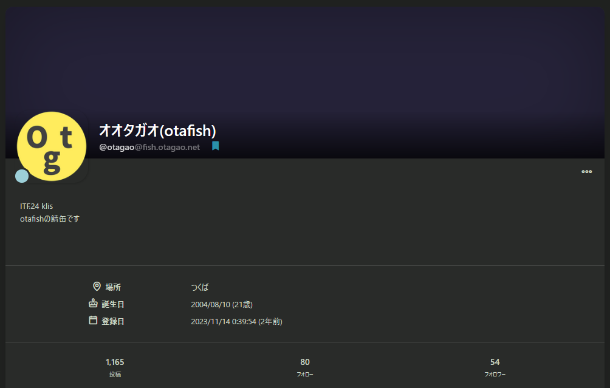

この記事は、[klis Advent Calendar 2025](https://adventar.org/calendars/11538)の17日目の記事です。

投稿日時を好き勝手編集できる性質上、この記事の投稿日時は「12/17」となっていますが、実際のところ私はこの記事を **2026年1月1日** に書いています。新年あけましておめでとうございます😇

大幅に遅延し、アドカレなのに年を越えて投稿する羽目になってしまい、本当に申し訳ありません……

<iframe src="https://adventar.org/calendars/11538/embed" width="620" height="362" frameborder="0" loading="lazy"></iframe>

↑[kivantiumさんの記事](https://kivantium.hateblo.jp/entry/2021/12/18/034810)を参考にしたら埋め込めた！やった～

## はじめに

イーロン・マスクが買収したSNSである **X(旧Twitter)** は、度重なる仕様変更により徐々に住みにくい場所となってきている……と思う人もいるようです。そして、そうした仕様変更のたびにXの住民から「ここが新天地だ！」といきなり持ち上げられて大移動され、「結局こことここがダメ！」といきなり失望されて大帰還されることでおなじみなのが、 **分散型SNS** です。

既に世の中には分散型SNSについて紹介することを目的とした記事が多数存在し、<u>「技術的にどう実装されているのか」「Xと違って何ができて何ができないのか」</u>といった説明は頻繁になされており、Xでも度々投稿が回ってきます。しかし実際のところ、そうした記事がバズったところで完全にXを辞め、分散型SNSに移住する人はごく少数というのが現実です。

それは端的に言うと、Xが持つ **圧倒的な人口** と、 **おすすめタイムラインの強烈な依存性** という2つの魅力に抗うのが難しすぎるところに理由があります。「YouTubeはオワコンだからTikTokだけ見る！」とか「ショート動画を見てると時間が無限に食われるからニコニコ動画しか見ない！」といった決心が通用するわけないように、たとえ文字主体のSNSであっても完全に移住するのは非常に困難を極めるわけです。

そこでこの記事では発想を少し変え、Xからの **移住先ではなくあくまで追加の選択肢** 、あるいは別荘として、fediverseの世界で楽しく過ごしていく方法を紹介したいと思います。



この記事は基本的に「SNSは普段Xをメインに使っている人」を前提として書いています。普段利用するSNSの種類が大きく異なる場合、記事内で紹介する「始め方」をうまく適用できない場合がありますのでご了承ください。



### 簡単な用語説明

- **分散型SNS**: 複数のサーバー同士で「連合」を組み、お互いが保有するアカウントの投稿を送受信できる仕組みが備わったSNSのこと。
- **連合(federation)**: 別々の分散型SNS同士で投稿を送受信すること。ほとんどのサーバーで有効になっているが、サーバーによっては連合機能が制限されていたり、そもそも一切使えなかったりする（後述）。
- **fediverse**: 分散型SNSの連合により成り立つネットワークのこと。federationのuniverseでfediverse。

## 始める上での心構え

### 強みを最大化する

どのようなサーバーソフトウェア、どのような運営形態であろうが、分散型SNSは完全なXの上位互換や代替にはなりません。というかSNS以外でも、何かのサービスの完全な代替になるサービスなどこの世界にはなかなか存在しないでしょう。先程も述べましたが、「完全な代替」として移住を試みるのではなく、Xの持つ弱点を突ける長所を探し、そこだけを伸ばし広げていく形で付き合っていくのがベターだと考えます。

例えば **「好きな絵師がAI騒動でXから離れてしまった」** のを弱点とするなら、まず単純に **「好きな絵師がいる」** こと自体が分散型SNSの長所となるわけです。この場合、<u>Xの持つ「フォロー中のユーザーが多く時間を潰せる」という長所は潰しきれていません</u>。ここで無理して常に分散型SNSのタイムラインに張り付こうとすると、Xと比較して全然更新されないタイムラインに嫌気が差してすぐ離脱してしまうことになりかねません。「週に一度フォローユーザーの更新を確認する習慣をつける」や「RSSリーダーで新着投稿を自動取得・通知する（後述）」といった、 **パッシブな付き合い方** が有効になると思います。

逆に、Xに対してあまり不満がなく、 **「自分が繋がるコミュニティを増やしたい」** という積極的な動機があるなら、とにかくユーザーが多いサーバーを探し、自分と雰囲気が合うものに登録し、毎日アクセスして雑談的な内容を投稿する……といった **アクティブな付き合い方** が有効になってくるはずです。

### ハードルを下げる

アカウントだけ作って放置してしまう理由としては、 **普段使っているアプリと違う方法でアクセスしないといけないのがシンプルに面倒だから** という点も大きいです。特にMisskeyには公式アプリが存在しないため、スマホからのアクセスには少しハードルが高いのです。これを解決するためには、公式アプリがあるならダウンロードしてXのアプリの横に配置する、公式アプリがないならサイト自体を[PWA](https://help.qiita.com/ja/articles/qiita-pwa)として「ホーム画面に追加」するなど、とにかく普段Xを開くのと同じような感覚でアクセスできる状態を目指しましょう。Web経由によるアクセスと公式/非公式アプリによるアクセスの違い・注意点については、[のえるさんの投稿](https://fedibird.com/@noellabo/115819168006495487)で詳しく説明されているのでぜひ読んでみてください。

また、これはオタク向けの話になってしまいますが、実は **分散型SNSの多くはRSSを喋ることができます** 。少なくともBluesky/Mastodon/Misskeyの公式実装ではそうなっています。例えば私のアカウントで試すと、BlueskyならアカウントのURL末尾に`/rss`を付けて https://bsky.app/profile/otagao.net/rss のようにすれば表示できるし、MastodonやMisskeyでは https://fish.otagao.net/@otagao.rss のように末尾に`.rss`と付ければOKです。「絶対に鍵垢/フォロワー限定で投稿することがない」アカウント、例えば企業公式やトップクラスのクリエイターなどしかフォローする気がない場合、そもそも **一々アカウントを作らずにRSSリーダーを活用する** というのも方法の一つでしょう。

## 具体的な始め方、続け方

ここまで心構えを上から目線で色々と書いてきました。そろそろうざったくなってきた頃合いだと思うので、ここからは、とにかく具体的に「オオタガオが考える、高い定着率で分散型SNSを始める方法」を説明していきます。

文章で説明する前にmermaid（←うおおおおおお人魚きたあああああああああ）で図示してみると、


flowchart TD
    A[分散型SNSを
    始めたい] --> B{どうして
    始めたい？}
    B --> |なんとなく気になる|E
    B --> |フォローしたい人がいる|C{その人がいる
    サービスは？}
    C --> |ActivityPub系|D{連合してる？}
    D --> |Yes|E(雰囲気の合うサーバーに
    アカウントを作る)
    D --> |No|F(そのサーバーに
    アカウントを作る)
    C --> |AT Protocol系|F
    E --> G{分散型SNSで
    何をしたい？}
    F --> G
    G --> |Xと同じように
    交流したい|H(アクティブな人を
    積極的にフォロー)
    G --> |鍵垢/縮小垢のように
    運用したい|I(投稿しやすさを
    追求)
    G --> |好きなフォロワーの
    投稿を追うだけ|J(リーダー主体の
    運用も視野)


このようになります。色々と不明な用語も多いと思うので、順を追って解説していきます。

### サーバーを選ぶ

まず、自分がアカウントを作る分散型SNSサーバーを決めないことには話が始まりません。友人知人や好きなクリエイターが移住したから後追いで、というなら単純にそのサーバーにアカウントを設ければいいようにも思えますが、ここで気をつけるべきことがいくつかあります。

1. プロトコルについて
2. サーバーの区別について
3. 「連合」の有無について
4. 重要な仕様について

#### プロトコルについて



この記事ではActivityPubを話すサーバーに重点を置いて説明しており、AT Protocolに関しては説明不足であり[Nostr](https://github.com/nostr-protocol/nostr)に至っては説明を放棄しています。理由としてはユーザ数の問題もありますが、お恥ずかしながら私がアカウントを作成しておらず、仕様も十分に理解できていないためです。



「分散型SNS」と一括りにされがちなBlueskyとMisskey/Mastodonですが、実は両者は連合するためのプロトコル、簡単に言うと話す言語が異なります。BlueskyはAT Protocolを喋り、MisskeyやMastodonはActivityPubを喋ります。一部例外的な手段[^1]は存在しますが、基本的に **BlueskyとMisskey/Mastodonでは技術的に連合できません** 。

AT Protocolの開発を先導するのはBlueskyのチームであり、Blueskyにおいては公式PDS(Personal Data Server)であるbsky.socialの規模が圧倒的に大きいです。つまりBlueskyの雰囲気が気になる、Blueskyで活動報告している人を追いかけたい、という場合は **bsky.socialにアカウントを作成する** 以外の選択肢がほぼありません。<u>これからサーバー選びに関してはActivityPubを使うMisskey/Mastodon系に絞って説明していく</u>ので、「サーバーで楽しむ」の章まで読み飛ばしてください。

#### サーバーの区別について

サーバーを選ぶに当たってまず注意してほしいのは、例えば「MisskeyはXXXみたいなユーザーしか居なくてXXXである」といった意見における”Misskey”は、（その発信者が日本人であるなら）大抵の場合[misskey.io](https://misskey.io/)を指しているし、「MastodonはXXXしか～」といった意見においては[mstdn.jp](https://mstdn.jp/)や[Pawoo](https://pawoo.net/)を指しているという点です。 **「Misskey」や「Mastodon」はあくまでもサーバー側で動くソフトウェアの名前であって、具体的なサーバーの名前ではありません** 。これらは日本における最大規模のMisskey/Mastodonサーバーであり、したがって「外野から適当に石を投げた/観測した時のヒット率」が最も高いことから、このような誤解が生まれてしまうわけです。

しかし当然ながら、日本にmisskey.ioやmstdn.jpしかサーバーが存在しないわけではありません。世の中には趣味や思想、コミュニティにより形成された無数の分散型SNSサーバーがあります。サーバーごとに雰囲気が大きく異なるし、そもそも機能面で若干の修正や制限が施されていることもあります。

……と、ここで勘の良い読者ならお気づきの点があると思います。そう、「分散型SNSは別のサーバーと繋がれることを売りにしているのに、どうしてサーバーごとに大きく雰囲気が変わるのか？」という点です。これは簡単な話で、 **別のサーバーと接続する「連合機能」はユーザーが動かない限り有効にならない** のです。つまり、”サーバーA”にいる誰かが自発的にフォローしたり、投稿を拡散したり、リプライを送受信したりしない限りは、”サーバーB”にいる人々のことは完全に存在しないものとして扱われてしまうのです。<u>サーバーの雰囲気は「具体的に内輪でどのような投稿がなされているか」という要素だけでなく、「外部のどのような投稿が拡散されているか」という要素でも決定される</u>というわけです。

「アカウントを作らない状態でそういう雰囲気を確認するのって無理だろ、結局一番人数が多いサーバーに登録するのが安牌じゃね？」と思うかもしれませんが、まだ諦めないでください。 **多くのサーバーでは「エクスプローラー」あるいは「ハイライト」機能がデフォルトで全開放されているのを利用する** とよいです。サーバーのURL末尾に`/explore`と入力すれば、対応しているサーバーならそこで人気を集めている投稿を確認できます。misskey.ioなら https://misskey.io/explore 、mstdn.jpなら https://mstdn.jp/explore と入力すれば可能です。あるいは単純に、そのサーバーのローカルタイムラインを確認するのも手でしょう。例えばPawooなら https://pawoo.net/public/local にアクセスすれば、そのサーバーでリアルタイムに投稿・拡散が行われている投稿一覧を確認できます。ユーザー数や流速もある程度把握できるので、こちらもかなりオススメできる方法です。

そもそもサーバーをどう探せばいいのか？という点については、[fedidbのサーバーリスト](https://fedidb.com/servers)にアクセスするのをおすすめします。英語圏のサーバーも多く表示されますが、少し下の方まで探せば日本語主体のサーバーも容易に見つけることができます。

#### 「連合」の有無について

分散型SNSの一番のメリットといっても過言ではない連合機能ですが、実は **一部サーバーでは無効化されている場合があります** 。変なサーバーと繋がってトラブルに巻き込まれたくない、連合による無駄な通信量を削減したい、悪意あるユーザーを弾きたい、身内だけで完結したいなど理由は様々ですが、とにかく無効化されていてはこちらからはどうしようもありません。アカウントを登録してからでは遅いので、事前にaboutページや管理者からのお知らせ、言及を確認するなどしておきましょう。

また、完全に無効化されていなくても<u>ホワイトリスト（管理者が指定したサーバーとしか連合できない）やブラックリスト（管理者が指定したサーバーとは連合できない）が適用されていることもある</u>ので注意が必要です。個人的には連合が幅広く解放されているサーバーに登録するのを勧めますが、そもそも好きな人が連合無効化のサーバーに登録している場合はどうしようもありません。「分散型」の理念に反するようにも思える話ですが、そうしたサーバーにはサブアカウントとして登録し、メインのアカウントは別のサーバーに用意するというのも一つの選択肢です。

#### 重要な仕様について

これは連合の有無についても若干被る内容ですが、 **ソフトウェアやサーバーによってはXに当然のように存在していた機能が実装されていない、あるいは無効化されている** 場合があります。たとえば **「おすすめタイムライン」** や **「鍵垢」** 、 **「ダイレクトメッセージ」** 機能などです。鍵垢機能に関しては、存在しないというより「投稿ごとにフォロワー限定公開か否かを選択できる」「フォロー自体は許可制にできるが、やろうと思えばいつでも投稿は全体公開できる」というパターンもあります。

「〇〇がない、やり直し」という~~ガチで面白くないオタクの~~減点方式でいくと損するので、まずは自分の中で絶対に譲れない機能を探し、それが実装されているサーバーを選ぶという加点方式を採用するべきでしょう。

### サーバーで楽しむ

アカウントを作ったら、タイトルにもある「細く長く楽しむ」を実践していきましょう。

#### ヘビーユーザーを探す

まず、 **Xほど高精度に人間の感情を動かせるおすすめタイムラインを備える分散型SNSは存在しません** 。今までXのおすすめTLの存在を~~憎まず~~楽しんでいた人で、かつ分散型SNSでもそれなりに「色んな人の投稿を見て交流する」ことを目的としているなら、積極的に自分でタイムラインを構築していく必要があります。ここでおすすめなのは、「めちゃくちゃ他人の投稿を拡散しまくってるヘビーユーザーをフォローする」ことです。

多少自分と馬が合わないと感じても、ある程度の趣味が合う人ならフォローし、とにかく自分の目に入る投稿の数を増やしていきましょう。ひどい言い方になりますが、「おすすめTLを再現するための人力」を集めてください。その人が流してくる投稿がそれ以外の投稿を下回るようになってきたら、フォロー解除してしまっても問題ありません。

サーバーによっては、「アンテナ」や「フィード」や「チャンネル」と呼ばれる機能で自分好みの投稿を追跡することができます。もちろんそれは十分にパワフルであり、活用すると大量の投稿を楽しむことができるのですが、最終的には「フォロー中のタイムライン」だけで必要な情報全てを完結させることを目標にすべきです。何故なら、 **「Xのタイムラインを眺める」よりも複雑な操作を情報収集のために行っているとだんだん疲れてしまう** からです。そもそもX自体が備える「コミュニティ」機能でさえ使っている人はごく少数でしょう。記事の最初の方でも似たことを述べましたが、私たちがXにハマっている/いた理由として「情報収集がお手軽である」が占める割合は大きく、とにかく情報をXのような手軽さ・正確さで垂れ流せる状態にすることが重要です。

そうしたユーザーはローカルタイムライン/グローバルタイムラインから探すのも良いですが、 **「ピン留めユーザー」「人気のユーザー」「おすすめユーザー」などの形で掲示されている人をフォローする** のも十分効果的です。

#### コアユーザーも探す

また、分散型SNSの面白さとしては **「XのようなまともなSNSで書いたら色々な怒られ・炎上が発生するであろう内容」** をバンバン書くような人が存在することも忘れてはいけません。暗号技術やOSINTに関する内容、浅慮な人を集めやすすぎる政治的トピック、~~そして大企業が運用するSNSならリスクヘッジのために秒速でBANされそうな特殊性癖~~など、様々な内容があります。

もちろんあまりにも極端すぎる人をフォローするのはリスクを伴いますが、<u>「結局どんだけTLを充実させようがXの縮小版じゃね？」というマンネリ感を打破する</u>には十分すぎる刺激となること間違いなしです。

注意点として、そうした「コアすぎる人」が別のサーバーにいる状態でリモートフォローし、新たに連合する場合は慎重になったほうがいいかもしれません。連合するとサーバーによっては相手の投稿内に含まれるテキストや画像、動画がローカル保存されることもあるので、場合によってはサーバー管理者が色々な責任を負うことになるかもしれません。

#### 投稿環境を整える

分散型SNSを「Xよりもユーザーが少ない秘密の隠れ家」的に運用するのも一つの手ではあります。その場合は単純に、投稿する環境さえ整えてしまえばOKです。公式/非公式アプリやPWAを活用して、 **Xのアプリを起動するのと同じ感覚でアプリを立ち上げられる状況** を目指せば良いでしょう。

あなたの投稿が面白ければ、あるいはあなたが属する界隈が多数の分散型SNSユーザーを抱えているなら、何もしなくてもそれなりに人が集まってきて次第にタイムラインが充実してくるはずです。集まらなくてもそれはそれで、隠れ家的に使い続ければOKですし。

#### リーダーを使う

そもそも分散型SNSを既存SNSの代替として目指しておらず、単純に **「好きな人が移住したからその人の投稿だけ追えればいい」** というのなら、先述したRSSリーダーを使うのもオススメです。RSSは古くから受け継がれてきた規格なので、それに対応したリーダーであれば定期的・安定的に投稿を取得してプッシュ通知を送ってくれるはずです。

問題点として、<u>追いかけたいユーザーが「ログインしていないユーザーからの閲覧を防ぐ」ための設定を有効にしていたり、投稿の一部を「フォロワー限定」にしているような場合</u>は、一部の投稿が歯抜けで取得されたり、そもそもRSSを吐いてくれないことがあります。そうしたときは素直に諦めてアカウントを作成するか、あるいは「何も情報が入ってこないよりはマシだ」と割り切って歯抜けのまま楽しむべきでしょう。

## 結論

ここまで書いてきたことを活かして、皆さんもfediverseで知識共有現象を……

**ド　オ　ン**

！？

otafishの…オオタガオ？

どうして今ここに…

オオタガオ「ここまで読んでくれたお前に、素晴らしい提案をしよう！

**お前も[otafish](https://fish.otagao.net/)に登録しないか？** 」

----

というわけで、最後は私が運営しているサーバー、otafishについて宣伝させてください。

otafishは「なんか自分独自のサーバーってカッコよくね？」という私の意思により運営されているサーバーです。基本的[^2]には全てのActivityPubサーバーに対して連合することができます。サーバーソフトウェアとしては、Misskeyフォークである[Firefish](https://wiki.misskey.io/ja/software/firefish)……のフォークである[Iceshrimp](https://iceshrimp.dev/iceshrimp/iceshrimp)を使っています。Misskey用/Mastodon用の両方のクライアントアプリ（の多く）に対応しているはずなので、アカウントさえWebから作ってしまえば後は使いやすいアプリを選んで接続することが可能です。

グローバルタイムライン（サーバーにいる全ての人・全ての連合アカウントの投稿を表示する）が無効化されているので、他人のタイムラインにバレることを気にせず自由にフォローや交流を行うことができるのも売り……にしたかったのですが、なんと「ハイライト」機能のリモート参照を無効化する方法が分からず、現在は **ハイライトページを開くと激エロアカウントの投稿が大量に確認できる** 状態になっています。私のサブ鍵アカウントで「エロければどんなジャンルでもいいや！ｗ」と軽率にフォローしたことが原因です。 **助けてくれ**

大規模サーバーに参加するのはなんかヤダ！知ってる人が多いサーバーで始めてみたい！連合も試してみたい！という~~逆張りクン~~仲間は、ぜひ登録してみてください。お待ちしています。

[^1]: [Bridgy Fed](https://fed.brid.gy/)というサービスがありますが、完璧な互換性はありません
[^2]: 連合機能を悪用した大規模な荒らしが発生した際には、セキュリティ面で脆弱だったサーバーをいくつかブロックしました
