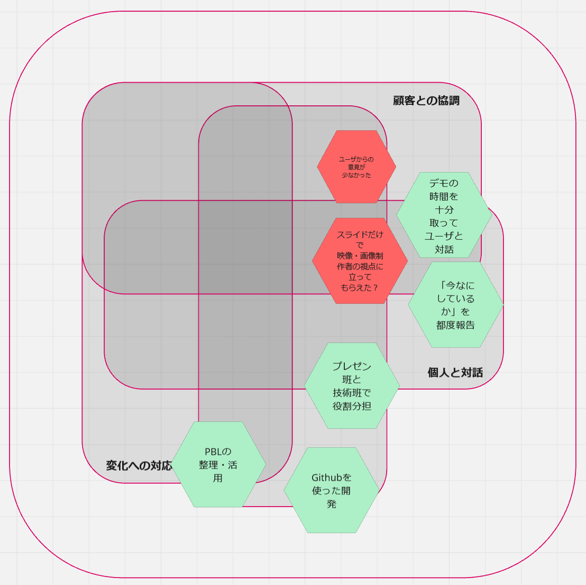

> [!WARNING] 教員の方々へ
> 本当に申し訳ありません、このメッセージが表示されているということは記事がまだ完成していないことを意味します
>
> 今日中には絶対に完成版として改稿しますので、改めて閲覧していただきたく思います

## はじめに

昨年の9月から今年の1月末まで、私は筑波大学・琉球大学で開講された **enPiT** に参加しました。enPiTとは **「日常での身近な困りごとを解決するプロダクトを作る」** という方針のもと、チームでアジャイル開発を行うプログラムです。

制作したプロダクトの概要やプログラム全体の流れを振り返りつつ、授業で得た経験・知識を記録していきます。

> [!info]
> この記事は該当科目「enPiT（ビジネスシステムデザイン実践Ⅰ）」の最終レポートも兼ねており、プログラム後半である秋学期の振り返りが中心となります。

## 開発したプロダクト

プログラム前半の夏合宿では、私が提案した困りごとを元に **「チーム持ち物」** が結成され、 **「もちもちリスト」** というプロダクトを開発しました。これは一言で表すと **「持ち物リスト版の『[調整さん](https://chouseisan.com/)』」** とでも言うべきもので、リストを作成・共有することで旅行や授業などのイベントに向けた集団行動を円滑に行うことを目的にしていました。

秋学期の開始と同時にチーム持ち物は解散し、私は **「ブックマーク（仮）」** チームに合流しました。そこから数ヶ月をかけて開発したのが、拡張機能 **「らくらくNotion」** です。

### エレベーターピッチ

らくらくNotionについて、授業内でのエレベーターピッチ（短時間で要点を伝えるためのプレゼンテーション）をそのまま引用して説明すると

> [!tip] エレベーターピッチ
> **Notionでの参考資料管理を挫折** してしまった
>
> **映像・画像制作者** 向けの
>
> **らくらくNotion** というプロダクトは
>
> **Notionのテンプレート、拡張機能** です。
>
> これを導入することによって **Notionを参考資料管理向けに特化させること** ができ、
>
> **デフォルトのNotion** とは違って、
>
> **Notion初心者でも混乱せずに使い続けることができる**

といったものです。

### 仕様説明・アクセス

具体的にどう「参考資料管理向けに特化」させているのかというと、

- NotionへのWebページクリップ
- クリップ先データベースへのギャラリービュー自動挿入
- カスタムCSS注入によるNotionの表示簡略化

といった機能で **「Notionについて何も分からなくても、とりあえずNotionアカウントさえあれば拡張機能側の操作だけで参考資料のデータベースが構築される」** という状況を作ります。

プロダクトのコードはGitHubのリポジトリで管理しており、リリースページから実際に拡張機能をダウンロードしてChromeで使用することも可能です。最終成果発表会時点でのバージョンは **[v1.1.0](https://github.com/otagao/raku-raku-notion/releases/tag/v1.1.0)** です。



詳細な使い方については、[こちら](https://speakerdeck.com/hareyakayuruyaka/raku-raku-notion-20260128)から成果発表会で紹介されたスライドを参照してください。

## チームについて

秋学期の「ブックマーク（仮）」チームは以下の6人で構成されていました。

|名前|所属|役職・立ち回り|
|---|---|---|
|D.Hさん|情報メディア創成学類|プロダクトオーナー|
|Iさん|情報科学類|スクラムマスター|
|Tさん|比較文化学類→情報科学類|プレゼン・デモ担当|
|Mさん|知識情報・図書館学類|コーディング担当|
|M.Hさん|情報理工学位プログラム|コーディング担当|
|自分|知識情報・図書館学類|コーディング担当|

D.Hさん、Iさん、Tさんの3名がプレゼンテーション／デモンストレーションのクオリティアップに取り組み、Mさん、M.Hさん、そして私の3名がコーディングを行うという形で役割を分けました。

この分担は非常に効果的だったと感じています。毎授業の流れとして、

> プロダクトバックログ(PBL)を元にスプリントプランニング 
>
> → 開発
>
> → レビュー
>
> → PBLの見直し
>
> → 全体の振り返り

と繋がるのですが、どうしても時間が不足してしまいます。開発に集中しているとレビューのクオリティが落ちてしまいますし、レビューを意識しすぎるとあまり手を動かせていないのに少ない手札で戦略を立てる必要が生じてしまいます。方針を決定した後は「手元にある現状の成果物と、今後上がってくる見込みの新仕様をどう活かすか」

プレゼン・デモ担当は今仕上がっている

実際にコーディングしていると「〇〇を実装したい」というアイデアが浮かびがちです。私たちのチームはClaude Code, OpenAI Codex, Gemini CLIといったコーディングエージェントを積極的に活用する方針で進めたため、

そのまま容易にオーバーエンジニアリングに繋がってしまい、特にアジャイル開発においては各回ごとの短期目標であるスプリントゴールを達成することも困難になってしまいます。

口頭やGitHubのissue機能等を通じてチーム内で共有し

## 秋学期中の軌跡

秋学期では、数週間ごとに4つの「スプリント」が設けられ、それぞれのロングレビューに向けて開発を進めていきました。

### スプリント1/4

### スプリント2/4

### スプリント3/4

### スプリント4/4

いよいよ最終的な

### チームAMF

開発中、チームで **アジャイルマニフェストの4つの価値** 、つまり

1. **個人と対話**
2. **動くソフトウェア**
3. **顧客との協調**
4. **変化への対応**

に沿った振り返りボードである **AMF (Agile Manifesto Farm)** に振り返りを集積していきました。

毎回新規作成する「スプリントAMF」と、その中で特に継承すべきだと感じたものを転記する「チームAMF」に分かれており、以下は **最終的なチームAMF** です。

黄緑色の六角形が **「良かった点」** 、赤色の六角形が **「改善が必要な点」** を指しています。

プロダクトの性質上、どうしても「ユーザーを巻き込んでレビューを貰う」という点に困難がありましたが、チームでの開発には

## 個人的ふりかえり

### 学んだこと

enPiTで学んだことは複数ありますが、第一にアジャイル開発での方針決定の重要性が挙げられます。私は

### 今後への展望

## おわりに

数カ月間のenPiTでの学びを通して、アジャイル開発とは何たるかを実践的に理解することができました。

また、「らくらくNotion」は喜ばしいことに成果発表会で優秀賞をいただきました。これはチームが一丸となって取り組んだからこその成果であり、1人でも欠けていたらここまでのクオリティに達することは困難だったと思います。

ご指導いただいた講師の方々、そしてチームメンバー全員に深く感謝します。